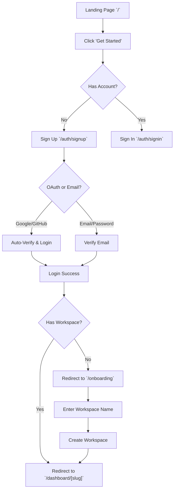
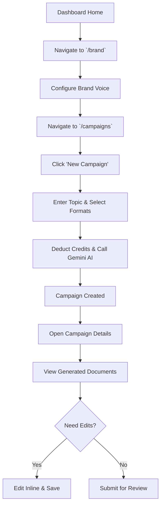
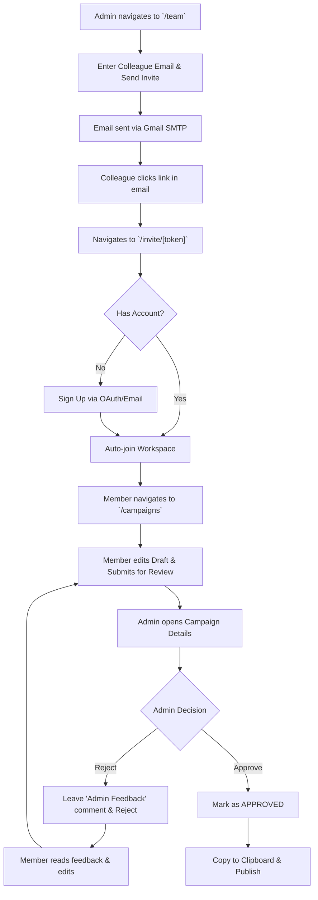

# App Flow & User Journey: SaaSify

This document outlines the core user journeys, step-by-step application flows, and the complete navigation structure (sitemap) of the SaaSify platform.

---

## 1. Primary User Journeys

### A. New User Onboarding Journey
The goal of this flow is to convert a visitor into an active workspace owner.

### B. AI Content Generation Journey
The core value loop where users define their brand and generate marketing materials.

### C. Team Invitation & Review Journey
The multiplayer flow for team collaboration and content approval.

---

## 2. Navigation Map (Sitemap)

The application uses the Next.js App Router. Below is the complete route tree outlining how screens connect to each other.

### 🌐 Public & Auth Routes
Pages accessible to anyone on the internet.

- `/` (Landing Page)
  - `->` **Get Started** routes to `/auth/signup`
  - `->` **Login** routes to `/auth/signin`
- `/auth/signin`
  - Options: Google, GitHub, Magic Link, Password
  - `->` **Forgot Password?** routes to `/auth/forgot-password`
  - `->` **Don't have an account?** routes to `/auth/signup`
- `/auth/signup`
  - Options: Google, GitHub, Password registration
- `/invite/[token]`
  - Dynamic route for accepting email invitations. Prompts user to log in or register before granting workspace access.

### 🏢 Protected Dashboard Routes
Routes protected by Next.js Edge Middleware. Require a valid session token.

- `/onboarding`
  - A dead-end route strictly for users who have signed up but belong to 0 workspaces. Users cannot navigate away until they create a workspace.
- `/dashboard/[workspaceSlug]`
  - **Overview Page**: Displays interactive Recharts for revenue and active users.
- `/dashboard/[workspaceSlug]/campaigns`
  - **Campaigns List**: Table of all AI campaigns. Includes a "Create Campaign" modal.
  - `->` **Campaign Details** routes to `/dashboard/[workspaceSlug]/campaigns/[campaignId]`
    - Displays individual `DocumentCard` components (Blog, Tweet, etc.).
    - Contains inline editing, status transitions, and the Admin Feedback box.
- `/dashboard/[workspaceSlug]/brand`
  - **Brand Voice**: Form to update the AI's Tone, Target Audience, Core Values, and Banned Words.
- `/dashboard/[workspaceSlug]/team`
  - **Team Management**: List of current members. 
  - Admin view: Includes "Invite Member" form and "Pending Invitations" table with revoke buttons.
- `/dashboard/[workspaceSlug]/billing`
  - **Subscription Portal**: Displays current plan (Free vs Pro) and remaining AI credits.
  - Includes a Stripe "Upgrade to Pro" checkout button or a "Manage Subscription" portal link.
- `/dashboard/[workspaceSlug]/settings`
  - **Workspace Settings**: (Admin Only) Options to rename the workspace slug or permanently delete the workspace.

---

## 3. Persistent UI Elements

When a user is inside the `/dashboard/[workspaceSlug]` layout, the following elements are always present:

1. **Sidebar Navigation (Left)**
   - Workspace Switcher Dropdown (Switch between tenant accounts)
   - Navigation Links: Home, Campaigns, Brand Voice, Team, Billing, Settings.
2. **Top Navigation Bar**
   - Breadcrumbs showing current page path.
   - Plan Badge (e.g., "Pro Plan").
   - Credits Badge (e.g., "🪙 42 Credits Remaining").
   - Dark/Light Mode Theme Toggle.
   - User Avatar Dropdown (Sign Out).
