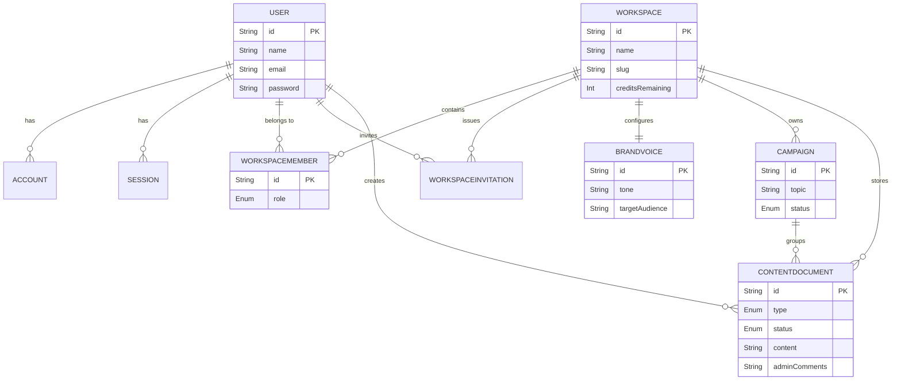

# Backend Schema: SaaSify

This document outlines the PostgreSQL database schema managed by Prisma. It details all tables, their columns, and the relationships between them.

---

## 1. Entity-Relationship Diagram

---

## 2. Authentication Layer

These tables handle user identity, social logins, and passwordless flows, strictly adhering to the `@auth/prisma-adapter` specifications for NextAuth.

### `User`
The central identity of a human interacting with the system.
| Column | Type | Attributes | Description |
|---|---|---|---|
| `id` | String | `@id` `cuid()` | Primary Key |
| `name` | String? | | User's display name |
| `email` | String? | `@unique` | Used for login and notifications |
| `emailVerified` | DateTime? | | Timestamp of email verification (Magic Links) |
| `image` | String? | | Avatar URL from OAuth provider |
| `password` | String? | | bcrypt-hashed password (null for OAuth users) |
| `createdAt` / `updatedAt`| DateTime | | Timestamps |

### `Account`
Stores OAuth provider profiles (e.g., Google, GitHub) linked to a `User`.
| Column | Type | Attributes | Description |
|---|---|---|---|
| `id` | String | `@id` `cuid()` | Primary Key |
| `userId` | String | `FK` | Links to `User.id` |
| `type` / `provider` | String | | e.g., "oauth", "google" |
| `providerAccountId`| String | | The user ID from the external provider |
| `access_token` / `refresh_token`| String? | | OAuth tokens |

### `Session` & `VerificationToken` & `PasswordResetToken`
- **`Session`**: Stores active database sessions. Includes `sessionToken` and `expires`. Links to `User.id`.
- **`VerificationToken`**: Stores Magic Link tokens. Includes `identifier` (email), `token`, and `expires`.
- **`PasswordResetToken`**: Custom table for traditional password resets. Includes `email`, `token`, and `expiresAt`.

---

## 3. Multi-Tenant Layer

These tables organize data into isolated `Workspaces`, enforcing boundaries between different customers.

### `Workspace`
The core tenant unit. Billing and AI credit limits are applied here.
| Column | Type | Attributes | Description |
|---|---|---|---|
| `id` | String | `@id` `cuid()` | Primary Key |
| `name` | String | | Display name of the workspace |
| `slug` | String | `@unique` | URL-friendly unique identifier |
| `stripeCustomerId` | String? | `@unique` | Stripe customer reference |
| `stripeSubscriptionId`| String? | `@unique` | Active Stripe subscription reference |
| `stripePriceId` | String? | | Current Stripe plan (Free vs Pro) |
| `stripeCurrentPeriodEnd`| DateTime?| | Renewal/Expiration date |
| `creditsRemaining` | Int | `@default(50)` | Available AI generation credits |
| `createdAt` / `updatedAt`| DateTime | | Timestamps |

### `WorkspaceMember`
The junction table connecting a `User` to a `Workspace` with a specific role.
| Column | Type | Attributes | Description |
|---|---|---|---|
| `id` | String | `@id` `cuid()` | Primary Key |
| `userId` | String | `FK` | Links to `User.id` |
| `workspaceId` | String | `FK` | Links to `Workspace.id` |
| `role` | Enum `Role` | `@default(MEMBER)` | Either `ADMIN` or `MEMBER` |
| `lastAccessedAt` | DateTime? | | Tracks recent activity |

### `WorkspaceInvitation`
Handles pending team invites sent via email.
| Column | Type | Attributes | Description |
|---|---|---|---|
| `id` | String | `@id` `cuid()` | Primary Key |
| `email` | String | | The invited person's email |
| `role` | Enum `Role` | `@default(MEMBER)` | The role they will assume upon joining |
| `token` | String | `@unique` `cuid()` | Secure token embedded in the email link |
| `workspaceId` | String | `FK` | Links to `Workspace.id` |
| `invitedById` | String | `FK` | Links to `User.id` (The admin who sent it) |
| `expiresAt` | DateTime | | Usually 7 days from creation |

---

## 4. App Domain Layer

These tables hold the actual business value generated by the users and the AI.

### `BrandVoice`
A 1-to-1 strict configuration for a workspace's AI generation rules.
| Column | Type | Attributes | Description |
|---|---|---|---|
| `id` | String | `@id` `cuid()` | Primary Key |
| `workspaceId` | String | `@unique` `FK` | Links to `Workspace.id` |
| `tone` | String? | `@db.Text` | The requested style (e.g., "Professional") |
| `targetAudience` | String? | `@db.Text` | Who the AI should speak to |
| `doNotUseWords` | String? | `@db.Text` | Banned vocabulary |
| `coreValues` | String? | `@db.Text` | Guiding principles |

### `Campaign`
A logical grouping of AI content generated from a single topic prompt.
| Column | Type | Attributes | Description |
|---|---|---|---|
| `id` | String | `@id` `cuid()` | Primary Key |
| `workspaceId` | String | `FK` | Links to `Workspace.id` |
| `name` | String | | User-defined title for the campaign |
| `topic` | String | `@db.Text` | The prompt provided to the AI |
| `status` | Enum | `@default(DRAFT)`| `DRAFT`, `IN_PROGRESS`, `COMPLETED` |

### `ContentDocument`
The actual generated content pieces (e.g., a specific Tweet or Blog Post).
| Column | Type | Attributes | Description |
|---|---|---|---|
| `id` | String | `@id` `cuid()` | Primary Key |
| `campaignId` | String | `FK` | Links to `Campaign.id` |
| `workspaceId` | String | `FK` | Links to `Workspace.id` |
| `title` | String | | Document title |
| `content` | String | `@db.Text` | The markdown text generated by AI |
| `type` | Enum | | `BLOG`, `TWEET`, `LINKEDIN`, `EMAIL` |
| `status` | Enum | `@default(DRAFT)`| `DRAFT`, `IN_REVIEW`, `APPROVED` |
| `createdById` | String | `FK` | Links to `User.id` (Who clicked generate) |
| `adminComments` | String?| `@db.Text` | Feedback left by workspace admins |
